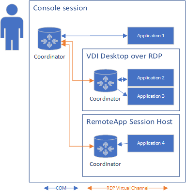

# Esatto Application Coordination

[](https://www.nuget.org/packages/Esatto.AppCoordination.Common)

Allow multiple applications to communicate with each other within the same session.  A 
"shell" application exposes the fact that an entity is open, and other applications can
add commands or otherwise change their behavior based on the shell application.

A background process called the coordinator receives notices from each coordinated 
application and distributes them to all connected clients.

Supports communication across multiple machines using Remote Desktop Virtual 
Channels to allow applications virtualized with RemoteApp to communicate with each other and 
with local applications.

## How it works

Each application publishes "entries" in the database.  Each entry has an address consisting of the
identity of the publishing application (`Path`) and the semantic `Key`.  The `Key` remains constant,
but is not unique (without `Path`). `Path` and `Key` are both `/` separated lists of nodes.  Nodes may be any string that does not contain
the characters `/` or `:`.

The coordinator is responsible for maintaining a single view of the database across all applications.
The set of all published entries is distributed back to each coordinated application asynchronously.

An example database as viewed by "Application 1" is where a document editor is open on two systems 
and "Application 2" is exposing commands would be:

```JSON
{
    "Entries": {
        "/App1/1/:/Entity/Document1/": { "DisplayName": "Document 1", "DocumentId": 1 },
        "/VDI1/App2/1/:/Entity/Document1/Command/": { "DisplayName": "Fax" },
        "/VDI1/App2/2/:/Entity/Document1/Command/": { "DisplayName": "Email" },
        "/VDI1/App2/1/:/Entity/Document2/Command/": { "DisplayName": "Fax" },
        "/VDI1/App2/2/:/Entity/Document2/Command/": { "DisplayName": "Email" },
        "/RemoteApp/App4/1/:/Entity/Document2/": { "DisplayName": "Document 2", "DocumentId": 2 },
    }
}
```

The coordinators will change the path as an entry flows through the system.  The path will be prefixed
with the source from which the entry was learned.  As an example, the entry "/Entity/Document1/Command/" 
was published on "VDI1" by "App2" and viewed from the console by "App1".  As it flowed, the path changed
from:

1. "/1/" as originally published by App2 on VDI1
1. "/App2/1/" as published by the coordinator on VDI1
1. "/VDI1/App2/1/" as published by the coordinator on the console

The inverse would happen for "/Entity/Document1/" published on the console and viewed on VDI1:

1. "/1/" as originally published by App1 on the console
1. "/App1/1/" as published by the coordinator on the console
1. "/Console/App1/1/" as published by the coordinator on VDI1

Communication:



## Usage
To build an application which uses `Esatto.AppCoordination`, add a reference to `Esatto.AppCoordination.Common`:

```MSBuild
<ItemGroup>
    <PackageReference Include="Esatto.AppCoordination.Common" Version="4.0.0-*" />
</ItemGroup>
```

Create a connection to the coordinator using `CoordinatedApp.Connect` then publish entries:

```CSharp
// Create a connection which will keep all events and callbacks on the current sync ctx
// and will not throw exceptions if no coordinator is available
using var app = new CoordinatedApp(SynchronizationContext.Current, silentlyFail: false, logger);

// Publish an entry to all applications with key /Entity/Example 1234/
var entry1 = ThisApp.Publish(CPath.From("Entity", $"Example {Process.GetCurrentProcess().Id}"), new()
{
    { "DisplayName", "Example 1" },
    { "example", "value" },
    { "poke", 1 },
    { "entityNumber", entityNumber }
})

// later, update the value of the entry
var updatedValue = entry1.Value.Clone();
updatedValue["poke"] = 2;
entry1.Value = updatedValue;

// or replace it
entry1.Value = new EntryValue() { { "poke", 3 } };

// retrieve the raw JSON
var jsonData = entry1.Value.JsonValue;
// replace with explicit JSON
entry1.Value = new EntryValue("{ \"poke\": 4 }");

// un-publish the entry by disposing it
entry1.Dispose();
```

Entries from other applications can be accessed via `CoordinatedApp.ForeignEntities`:
```CSharp
foreach (var entry in app.ForeignEntities)
{
    logger.LogInformation("Entry: {Entry}", entry);
    entry.ValueChanged += (sender, e) => logger.LogInformation("Entry {Entry} changed", entry);
    entry.Removed += (sender, e) => logger.LogInformation("Entry {Entry} removed", entry);
}
```

Entries matching a particular key can be monitored via `CoordinatedApp.ForeignEntities.CreateProjection(string)`:
```CSharp
// watch for all entries with the key "/Handler/DocumentPrinted/"
using var obs1 = app.ForeignEntities.CreateProjection("/Handler/DocumentPrinted/");
obs1.CollectionChanged += (sender, e) => logger.LogInformation("Collection changed: {Change}", e);

// watch for all entries with the prefix "/Entity/"
using var obs2 = app.ForeignEntities.CreateProjection(key => key.StartsWith(CPath.From("Entity"));
obs2.CollectionChanged += (sender, e) => logger.LogInformation("Collection changed: {Change}", e);
```

## IPC
Any entry can be "Invoked" by passing a request payload and receiving a response payload.  Failures are
propagated back to the caller as exceptions.  The format of the payload is not defined.  Operations
may not take more than 10 seconds to complete.  Payload may not exceed 1 MB.  If longer operations are
required, register a "completion" entry and asynchronously "return" the result as a new invoke.

A callback may be registered in the call to `Publish`:

```CSharp
// Publish an invokable entry as "/Example/Command1/"
using var entry2 = app.Publish(CPath.From("Example", "Command1"), new(), payload => 
{
    Console.WriteLine($"Received payload: {payload}");
    return "Ok";
});
```

Entries can be invoked via `ForeignEntry.Invoke`:
```CSharp
var entry = app.ForeignEntities.FirstOrDefault(k => k.Key == "/Example/Command1/")
    ?? throw new InvalidOperationException("Could not find Command1");
var result = entry1.Invoke("Hello World");
```

Exceptions thrown by the registered delegate are passed back to the caller as `InvokeFaultException`.
Arbitrary data may be passed as a failure by throwing `new InvokeFaultException() { RawPayload = json }`.
The error json should include a `Message` property with a human-readable error message.

## Static Entries
Applications may register "static entries" in the windows registry which are always published.  Typically,
these entries are used for file-association style activation of well-known actions.

Static entries are registered by the setup application of the providing application under 
`HKEY_LOCAL_MACHINE\SOFTWARE\In Touch Technologies\Esatto\AppCoordination\StaticEntries`
with a key containing an unique ID. The unique ID is not used or exposed.

```reg
[HKEY_LOCAL_MACHINE\SOFTWARE\In Touch Technologies\Esatto\AppCoordination\StaticEntries\SomeUniqueId1234]
@="/Example/Entry/Key/"
"DisplayName"="Example Entry"
"Description"="This is an example entry"
"Priority"=dword:00000001
```

produces

```JSON
{ "/Static/1/:/Example/Entry/Key/": { "DisplayName": "Example Entry", "Description": "This is an example entry", "Priority": 1 } }
```

If a static entry registers a `CLSID` value, the coordinator will `CoCreateInstance` the CLSID and cast
to `IStaticEntryHandler` when the entry is invoked.  An application may implement `IStaticEntryHandler`
and register a unique `CLSID` so it can be invoked even when closed.

Example entry and COM registration:

```reg
[HKEY_LOCAL_MACHINE\SOFTWARE\In Touch Technologies\Esatto\AppCoordination\StaticEntries\SomeUniqueId1234]
@="/Example/Entry/Key/"
"CLSID"="{003425B1-0503-4302-9F94-62250A6BE68A}"

[HKEY_CLASSES_ROOT\CLSID\{003425B1-0503-4302-9F94-62250A6BE68A}\LocalServer32]
@="C:\Program Files\foo\bar\baz.exe"
```

## Tooling
A demo client is available to view the database. It is installed by default on each coordinated system.
It can be launched from `C:\Program Files\Esatto\AppCoord2\Esatto.AppCoordination.DemoClient.exe`.

## Redistribution
An application may redistribute `Esatto.AppCoordination.Common`, and may opportunistically use AppCoord
by passing `silentlyFail: true` to the `Connect` method.  AppCoord is installed via the MSI installer.
A setup bootstrapper may check for an existing installation by detecting the presence of the registry
key `HKEY_CLASSES_ROOT\CLSID\{13853D88-306E-452E-89B1-B655BA3E82D0}`.

## Developer setup

In order to develop and test `Esatto.AppCoordination`, the following steps are required to
setup the developer machine.

> [!NOTE] 
> The following steps are only required for development and testing *of AppCoord*.  
> To develop or test an application which depends upon `Esatto.AppCoordination`, see the
> [Usage](#usage) section.

Since interaction between coordinated applications and the coordinator requires COM, 
the interfaces and TLB must be registered in `HKEY_CLASSES_ROOT`.  This registration 
may be done by running `regasm` from an elevated command prompt.

Install:

```Batchfile
C:\dev\gitroot\appcoord\Esatto.AppCoordination.Common\bin\Debug\net48>regasm /codebase /tlb Esatto.AppCoordination.Common.dll
Microsoft .NET Framework Assembly Registration Utility version 4.8.9032.0
for Microsoft .NET Framework version 4.8.9032.0
Copyright (C) Microsoft Corporation.  All rights reserved.

Assembly exported to 'C:\dev\gitroot\appcoord\Esatto.AppCoordination.Common\bin\Debug\net48\Esatto.AppCoordination.Common.tlb', and the type library was registered successfully
```

Uninstall:

```Batchfile
C:\dev\gitroot\appcoord\Esatto.AppCoordination.Common\bin\Debug\net48>regasm /u /codebase /tlb Esatto.AppCoordination.Common.dll
Microsoft .NET Framework Assembly Registration Utility version 4.8.9032.0
for Microsoft .NET Framework version 4.8.9032.0
Copyright (C) Microsoft Corporation.  All rights reserved.

RegAsm : warning RA0000 : No types were un-registered
Type library 'C:\dev\gitroot\appcoord\Esatto.AppCoordination.Common\bin\Debug\net48\Esatto.AppCoordination.Common.tlb' un-registered successfully
```

In order to auto-start the coordinator, the CLSID's of the coordinator must be registered:

```PowerShell
New-Item 'hklm:\SOFTWARE\Classes\CLSID\{13853D88-306E-452E-89B1-B655BA3E82D0}\LocalServer32' -Force `
    | Set-ItemProperty -Name '(Default)' -Value 'C:\dev\gitroot\appcoord\Esatto.AppCoordination.Coordinator\bin\Debug\net48\Esatto.AppCoordination.Coordinator.exe'
```

To have the coordinator registered with MSTSC:

```PowerShell
New-Item 'hklm:\SOFTWARE\Classes\CLSID\{281BB6F7-B2A9-40D7-9F02-8856E3EDC505}\LocalServer32' -Force `
    | Set-ItemProperty -Name '(Default)' -Value 'C:\dev\gitroot\appcoord\Esatto.AppCoordination.Coordinator\bin\Debug\net48\Esatto.AppCoordination.Coordinator.exe'
New-Item 'hklm:\SOFTWARE\Microsoft\Terminal Server Client\Default\Addins\{281BB6F7-B2A9-40D7-9F02-8856E3EDC505}' -Force `
    | Set-ItemProperty -Name 'Name' -Value '{281BB6F7-B2A9-40D7-9F02-8856E3EDC505}'
```